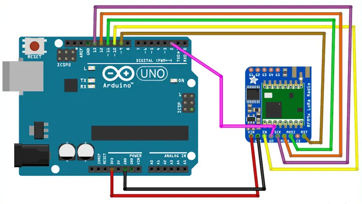
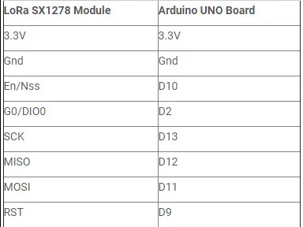
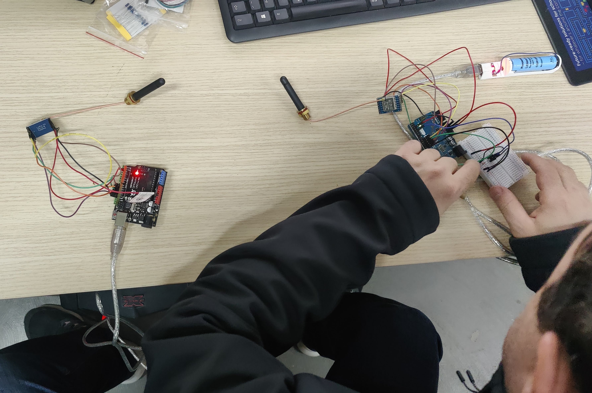

# Lora_module_ds1b20
Μετάδοση θερμοκρασίας σε μεγάλες αποστάσεις με lora module SX1278

## Lora Module SX1278 με τις κεραίες στα 434MHz 2dBi

   
  

## Σχηματικό Διάγραμμα του Κυκλώματος

   
  

## Συνδεσμολογία Lora στο Arduino UNO

   
  

 
 Συνδέστε το ds18b20 στον ακροδέκτη 4 του Arduino UNO (transmitter). Η αντίσταση είναι στα 4,7kOhm 

 
## Η παρουσίαση 

   
  <em>Ομάδα Κατασκευής: Γιάννης Γ., Άρης Τ., Δημήτρης Κ.</em>

